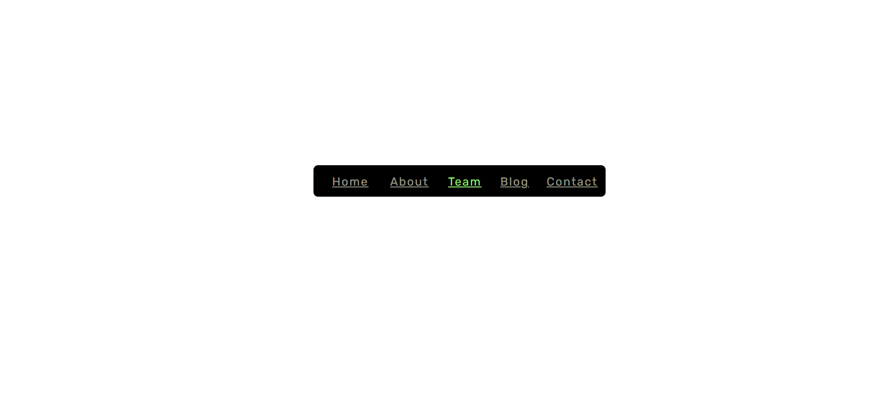

# Navbar challenge 1 #
[project-live](https://navbar-challenge1.netlify.app)
  - - - -
 # Technology used in this project #
     
    - - - -
* Skill Gained in this project
  * Learned to make the navbar section 
  * Learned to move the __navbar section__ in the __middle of the screen__
  
  * Learned to create buttons using __padding, border, heigth , width, border-radius and bg-clor__
   * Learned to align the content using __absolute, relative, gap, margin__
   - - - -
 ## Time taken to complete this project ##
 *  30 minutes to completed this poject
 
 ## Screenshot ##
 
 
 
